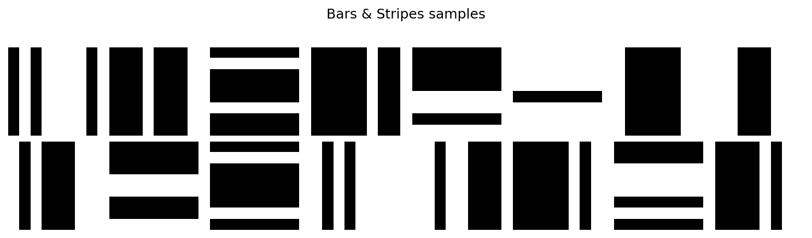
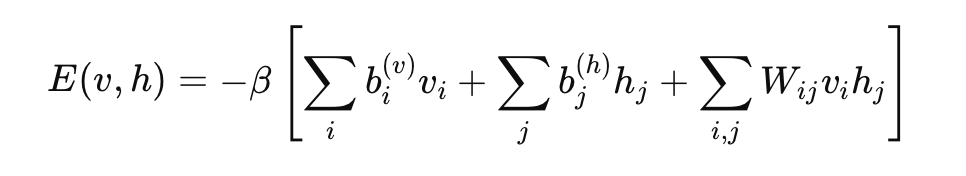
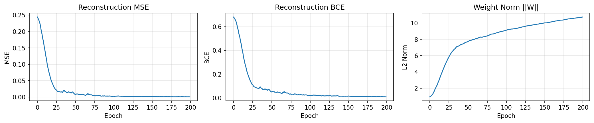
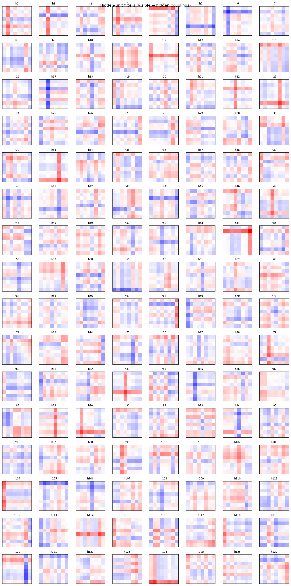
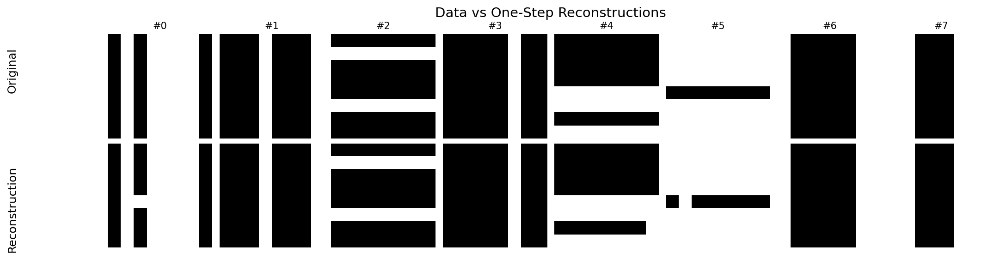
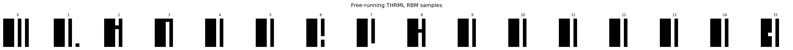
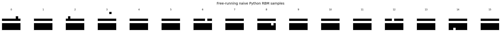

# THRML-Powered RBM Demonstration
### *Training an RBM on binary bars and stripes data*
Alen Ribić & Alessio Toniolo, 2025

---

# **Overview**

- Build a **Restricted Boltzmann Machine (RBM)** as an **Ising Energy-Based Model**
- Train it using **THRML’s KL Gradient Estimator**
- Evaluate using:
  - 1-step **clamped reconstructions**
  - **THRML free-running sampling**
  - **Naive Python Gibbs sampling**
- Show how **THRML acts as a general Gibbs engine**
- Visualize learned filters and sampling results

---

# **Dataset: 8×8 Bars & Stripes**

- Synthetic binary dataset used in EBM research
- Contains:
  - Horizontal bars  
  - Vertical bars  
  - Multiple bars per image  
- Structured, multimodal, ideal for generative testing

---

---

# **Training with THRML**

THRML provides:

- **Block sampling** engine  
- **KL divergence gradient estimator**  
- **Factor graph representation**  
- **Sampling schedules**  
- Multi-chain sampling via `batch_shape`

We train RBM parameters:
- weights $W$
- visible biases $b_v$, hidden biases $b_h$
- temperature parameter $\beta$

---

# **Our RBM/Ising energy function**

  

directly taken from the Gibbs/Ising Hamiltonian, and each sum corresponds to a physical energy term

- 1st term, external field on visible spins
- 2nd term, external field on hidden spins
- Pairwise interaction energy

---

# **Training Curves**

- **MSE** drops sharply → good reconstructions  
- **BCE** approaches ~0 → near-perfect predictions  
- Weight norm increases steadily → filters specialize

---

---

# **Learned Hidden Unit Filters**

- Each hidden unit learns a **feature detector**
- Filters resemble:
  - Vertical bars  
  - Horizontal bars  
  - Crossings  
  - Composite stripe patterns  
- RBM learns a **distributed encoding** of the dataset

---

---

# **Clamped 1-Step Reconstructions**

Process:
1. Clamp visibles to data
2. Sample $h \sim p(h|v)$
3. Sample $v' \sim p(v|h)$

Purpose:
- Validate training
- Check encoder–decoder consistency
- Ensure stable attractor basins

---

---

# **THRML Free-Running Sampling**

- Start from random spins  
- Run full Gibbs chain (no clamping)
- THRML explores the learned energy landscape
- Produces pure model samples

**Shows true generative behavior** of the RBM.

---

---

# **Naive Python Gibbs Sampling (Baseline)**

Why?
- Validate correctness of THRML sampler  
- Check if a hand-written sampler produces similar samples

Results:
- Python sampler produces Bars & Stripes  
- Confirms correctness of learned energy landscape  
- THRML behaves consistently with standard RBM sampling

---

---

# **Why Three Sampling Modes?**

### **1. Clamped Reconstructions**
✔ Measure training quality  
✔ Checks encoder/decoder mapping  
✔ Local consistency

---

### **2. THRML Free-Running Sampling**
✔ Explore full Boltzmann distribution  
✔ Checks generative behavior  
✔ Shows learned modes

---

### **3. Naive Gibbs Sampling**
✔ Baseline sanity check  
✔ Confirms THRML correctness  
✔ Ensures consistent energy landscape

---

# **What We Learned**

### **RBM Learning**
- RBM trained via THRML achieves extremely low recon error
- Filters reflect dataset structure

### **Energy Landscape**
- THRML free-running samples match Bars & Stripes
- Energy minima match dataset modes

### **Sampler Validation**
- Python Gibbs sampler matches THRML outputs
- Confirms correctness of THRML’s block sampler

---

# **THRML as a Gibbs Engine**

### **Benefits**
- Eliminates hand-written Gibbs loops  
- Works for **arbitrary** factor graphs  
- Supports multi-chain sampling  
- Hardware-friendly (GPU/TPU acceleration)  
- Clean integration with EBMs

### **Takeaway**
THRML can serve as a **general-purpose thermodynamic sampling engine** for probabilistic models.

---

# **Conclusion**

We successfully:

- Built a THRML-powered RBM  
- Learned structured representations  
- Generated high-quality samples  
- Validated sampler correctness  
- Demonstrated the feasibility of using THRML as a Gibbs engine

**A strong foundation for larger EBMs and future thermodynamic computing systems.**

---

# **Thank You**

Questions?  
Contact: Alen Ribić / @alenribic, Alessio Toniolo / @_alessiotoniolo
